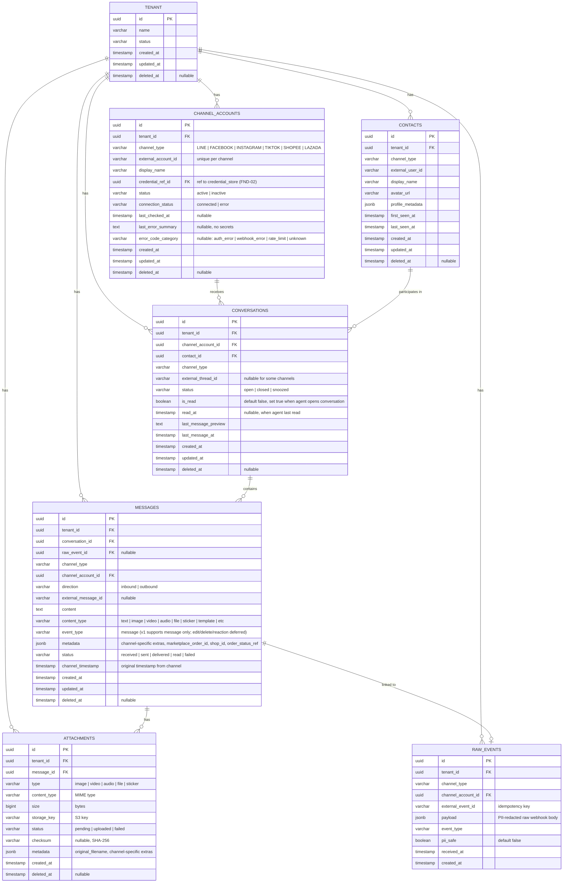

# ACE-37 (NDP-01): Define Normalized Schema v1 — ER Diagram

## Context

Entity-Relationship diagram for the normalized data schema v1. All channels (LINE, Facebook, Instagram, TikTok, Shopee, Lazada) are stored in one consistent model with multi-tenant isolation by design.

---

## ER Diagram

---

## Recommended Indexes

| Table | Index | Purpose |
|---|---|---|
| `messages` | `(tenant_id, created_at)` | Global timeline query |
| `messages` | `(tenant_id, conversation_id, created_at)` | Conversation thread pagination |
| `conversations` | `(tenant_id, channel_type, external_thread_id)` | Upsert lookup on inbound event |
| `contacts` | `(tenant_id, channel_type, external_user_id)` | Upsert contact on inbound event |
| `channel_accounts` | `(tenant_id, channel_type, external_account_id)` | Lookup channel account |
| `raw_events` | `(tenant_id, channel_type, external_event_id)` | Idempotency check |
| `attachments` | `(message_id)` | Join attachments to message |
| `conversations` | `(tenant_id, status, last_message_at)` | Inbox list sorted by recent |

---

## Unique Constraints

| Table | Constraint |
|---|---|
| `contacts` | `UNIQUE (tenant_id, channel_type, external_user_id)` |
| `channel_accounts` | `UNIQUE (tenant_id, channel_type, external_account_id)` |
| `conversations` | `UNIQUE (tenant_id, channel_account_id, external_thread_id)` WHERE external_thread_id IS NOT NULL |
| `messages` | `UNIQUE (tenant_id, channel_type, external_message_id)` WHERE external_message_id IS NOT NULL |
| `raw_events` | `UNIQUE (tenant_id, channel_type, external_event_id)` |
