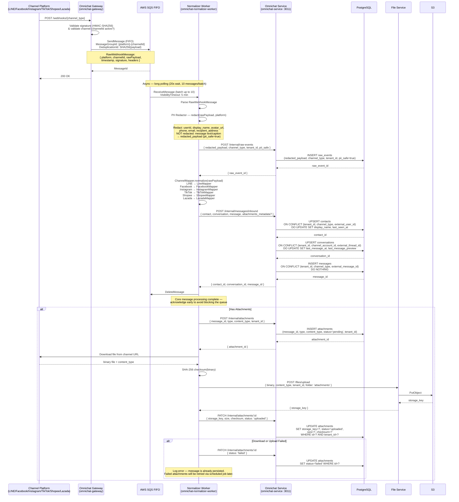
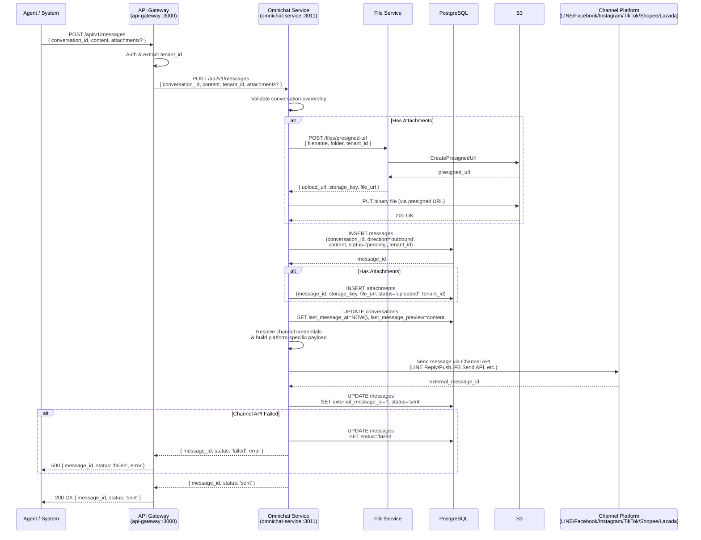
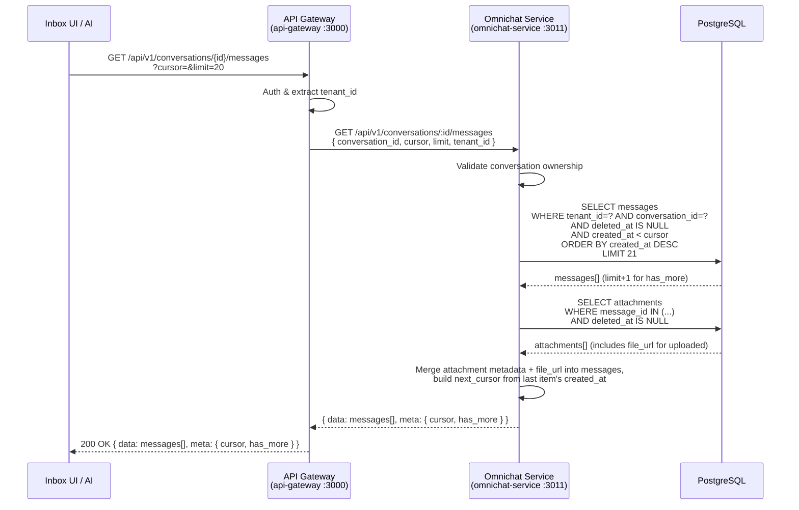

# ACE-37 (NDP-01): Define Normalized Schema v1 — Sequence Diagram (Microservice Architecture)

## Context

Sequence diagrams aligned with the actual microservice architecture of the project — clearly separated services communicating via **AWS SQS FIFO** (webhook → normalizer) and **HTTP** (inter-service sync calls).

---

## Service Overview

| Service | App Name (code) | Responsibility | Transport |
|---|---|---|---|
| **Omnichat Gateway** | `omnichat-gateway` | Inbound only — receive webhooks, validate signature, publish to SQS | HTTP REST (port 3010) |
| **Normalizer Worker** | `omnichat-normalizer-worker` | Poll SQS, PII redaction, normalize, download attachments — persist ผ่าน Omnichat Service (HTTP) | SQS Consumer (background) |
| **Omnichat Service** | `omnichat-service` | Core business logic — outbound messages (send directly to channel APIs), conversation management | HTTP (port 3011) |
| **File Service** | `file-service` | Manage S3 (presigned upload URL, binary upload — public bucket, static URLs) | HTTP (inter-service) |
| **API Gateway** | `api-gateway` | Entry point, routing, auth | HTTP REST (port 3000) |

### Rate Limiting (Omnichat Gateway)

| Window | Limit |
|---|---|
| Short (per second) | 5 requests |
| Long (per minute) | 100 requests |

---

## 1. Inbound Message Flow



---

## 2. Outbound Message Flow



---

## 3. Query Conversation Timeline



---

## SQS FIFO Configuration

| Setting | Value | Rationale |
|---|---|---|
| **Queue Type** | FIFO (.fifo) | Exactly-once processing, message ordering per group |
| **MessageGroupId** | `{platform}-{channelId}` | Messages from the same channel are processed in order |
| **DeduplicationId** | SHA256(payload content) | Prevent duplicate webhook delivery |
| **VisibilityTimeout** | 5 minutes | Allow worker time to process before message returns to queue |
| **WaitTimeSeconds** | 20 seconds | Long polling — reduce empty receives |
| **MaxMessages** | 10 per batch | Worker receives a batch and processes with Promise.allSettled() |

---

## Service Communication Map

```
┌──────────────┐
│   Channel    │
│  Platforms   │
└──────┬───────┘
       │ Webhook (HTTP)              ▲
       ▼                             │ Channel API (HTTP)
┌──────────────────┐    SQS FIFO    ┌──────────────────────┐
│ Omnichat Gateway │───────────────▶│  Normalizer Worker    │
│ (omnichat-gateway│                │  (omnichat-normalizer │
│  :3010)          │                │   -worker)            │
│                  │                │                       │
│ Inbound only:    │                │  - PII Redactor       │
│  - Signature     │                │  - Channel Mapper     │
│    Validation    │                │    (Strategy Pattern)  │
│  - Rate Limiting │                │  - Attachment download │
│    (5/s, 100/m)  │                │    (fire-and-forget)  │
│  - SQS publish   │                │  - Persist ผ่าน       │
└──────────────────┘                │    OmniSvc (HTTP)     │
                                    └──────┬──────┬─────────┘
                                           │      │
                                      HTTP ┘      │ HTTP
                                     (persist)    │ (upload)
                                           │      │
                                           ▼      ▼
                              ┌──────────────┐  ┌──────────────┐
                              │ Omnichat     │  │ File Service │──▶ S3
                              │ Service      │  │ (file-service│
                              │ (omnichat-   │  │  :HTTP)      │
                              │  service     │  └──────────────┘
                              │  :3011)      │        ▲
                              │              │        │ HTTP
                              │  - DB owner  │────────┘
                              │  - Resolve   │
                              │    credentials│
                              │  - Build     │──▶ Channel Platforms
                              │    payload   │    (HTTP — outbound)
                              │  - Send to   │
                              │    Channel   │
                              └──────┬───────┘
                                     │
                                     │ DB
                                     ▼
                              ┌──────────┐
                              │PostgreSQL│
                              └──────────┘
                                     ▲
                                     │ HTTP
┌──────────────┐             ┌──────────────┐
│   Agent /    │             │ API Gateway  │
│   Inbox UI   │────HTTP────▶│ (api-gateway │
└──────────────┘             │  :3000)      │
                             └──────────────┘
```

---

## Changes from Original (sequence.md)

| Topic | Original (sequence.md) | Updated (microservice — matches code) |
|---|---|---|
| **Webhook** | Webhook Receiver (single service) | `omnichat-gateway` as separate service — port 3010 |
| **Webhook → Normalizer** | Direct call | **AWS SQS FIFO** — async, decoupled |
| **Rate Limiting** | None | Throttler: 5 req/sec, 100 req/min |
| **Normalization** | Single pipeline handles everything (sync) | `omnichat-normalizer-worker` polls SQS (async) |
| **Message Ordering** | Implicit | SQS FIFO MessageGroupId: `{platform}-{channelId}` |
| **Deduplication** | None | SHA256 content-based deduplication |
| **Channel Mapper** | Generic "Normalize via Channel Mapper" | Strategy Pattern — each channel has its own Mapper |
| **DB Access** | All services call DB directly | **Omnichat Service เป็น DB owner ตัวเดียว** — Normalizer Worker persist ผ่าน OmniSvc (HTTP internal API) |
| **File Upload (outbound)** | API → S3 directly | API Gateway → Omnichat Service → File Service (HTTP) → S3 |
| **Attachment Download** | Queue → Worker → S3 (implicit) | Normalizer Worker handles it (fire-and-forget after SQS acknowledge) → File Service (HTTP) → S3 |
| **Attachment Download URL** | Not shown | Static public URL from DB (`file_url`) — no presigned download needed |
| **API Gateway** | Single "Omni API" | `api-gateway` :3000 routes to `omnichat-service` via HTTP |
| **Queue** | Amazon SQS (name only) | Full SQS FIFO flow: Send → Receive → Process → Delete |
| **Attachment Worker** | Separate worker | Not separated (MVP) — Normalizer Worker handles it; can split later if needed for scale |

---

## Implementation Status

| Component | Status | Notes |
|---|---|---|
| `omnichat-gateway` | **Partial** | LINE + Facebook webhook implemented; Instagram/TikTok/Shopee/Lazada are stubs |
| `omnichat-normalizer-worker` | **Scaffold** | SQS consumer works but missing PII redaction, Channel Mapper, attachment download — DB persist ผ่าน OmniSvc (HTTP) |
| `omnichat-service` | **Scaffold** | Nearly empty — no business logic yet |
| `file-service` | **Exists** | Already in use (shared with knowledge base) |
| Prisma Schema (omnichat tables) | **Not started** | No contacts, conversations, messages, attachments, raw_events tables yet |
| Shared Types | **Partial** | `PlatformType` enum + `RawWebhookMessage` exist but are duplicated across 2 services (not yet moved to shared package) |
