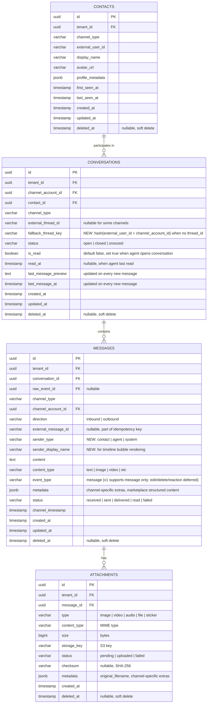

# ACE-38 (NDP-02): Message Persistence v1 — ER Diagram

## Context

Extends ACE-37 schema with fields required for persistence logic: idempotency keys, deterministic upserts, and sender info for timeline rendering. Marketplace structured content is stored in the existing `metadata` jsonb field.

---

## ER Diagram

---

## New Fields (vs ACE-37)

| Table | Field | Type | Purpose |
|---|---|---|---|
| `conversations` | `fallback_thread_key` | varchar | Deterministic key when `external_thread_id` is null |
| `messages` | `sender_type` | varchar | Distinguish contact vs agent vs system for UI bubble |
| `messages` | `sender_display_name` | varchar | Display name for timeline rendering |

---

## New Indexes

| Table | Index | Purpose |
|---|---|---|
| `messages` | `UNIQUE (tenant_id, channel_type, external_message_id)` WHERE external_message_id IS NOT NULL | Idempotency check |
| `conversations` | `UNIQUE (tenant_id, channel_account_id, fallback_thread_key)` WHERE fallback_thread_key IS NOT NULL | Fallback thread dedup |
