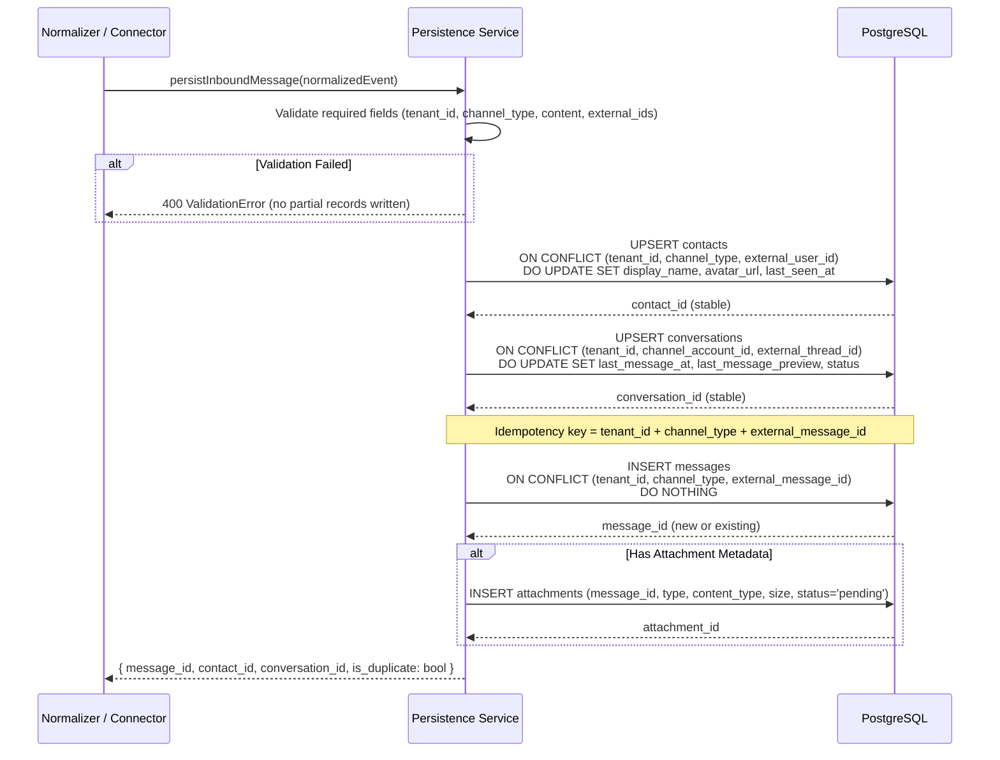
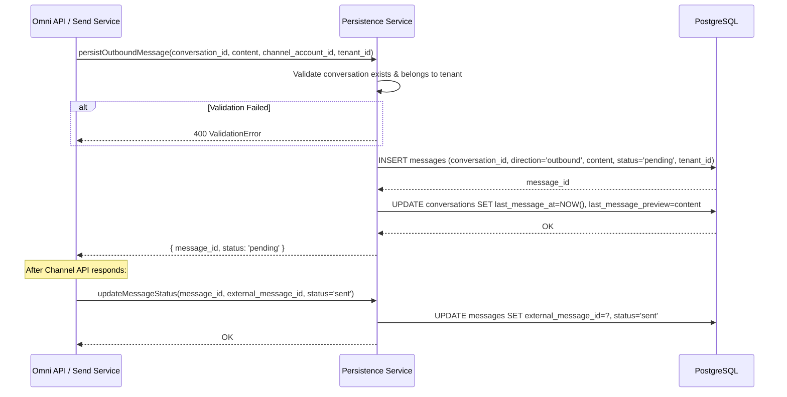
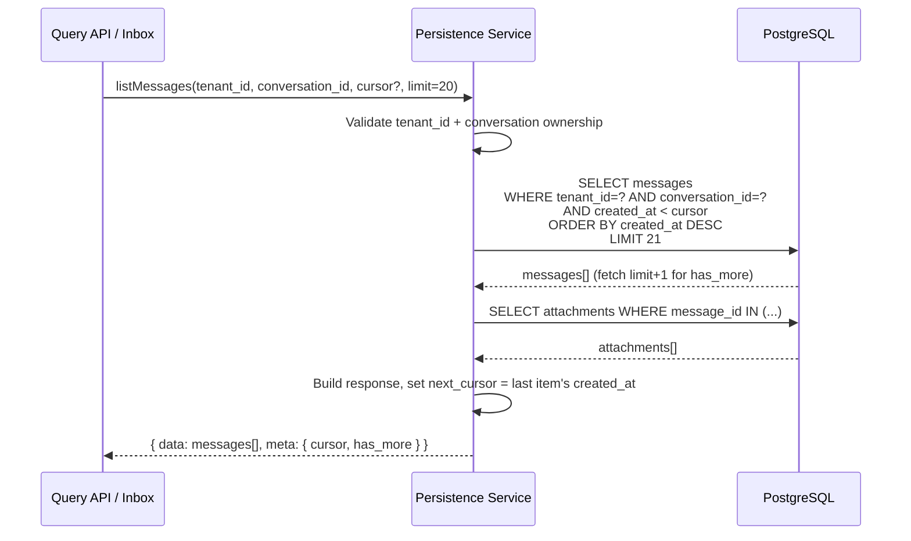
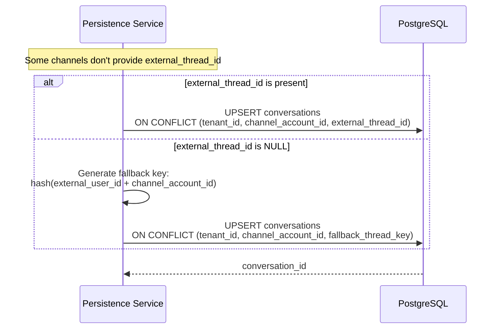

# ACE-38 (NDP-02): Message Persistence v1 — Sequence Diagram

## Context

Sequence diagrams for the persistence layer: idempotent message inserts, deterministic upserts for contacts/conversations, outbound message persistence, and query capabilities. Depends on ACE-37 schema.

---

## 1. Idempotent Inbound Message Persist

---

## 2. Outbound Message Persist

---

## 3. Conversation Timeline Query

---

## 4. Missing Thread ID Fallback

