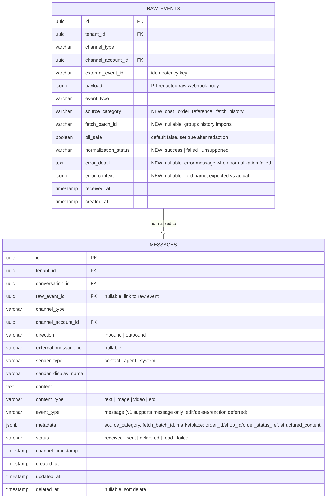

# ACE-39 (NDP-03): Normalization Pipeline v1 — ER Diagram

## Context

Extends ACE-37 schema with additional fields on `raw_events` for marketplace source categorization and normalization failure tracking.

---

## ER Diagram

---

## New Fields on `raw_events` (vs ACE-37)

| Field | Type | Purpose |
|---|---|---|
| `source_category` | varchar | `chat`, `order_reference`, `fetch_history` — classify event origin |
| `fetch_batch_id` | varchar nullable | Group history import batches together |
| `normalization_status` | varchar | `success`, `failed`, `unsupported` — track normalization result |
| `error_detail` | text nullable | Human-readable error message when normalization failed |
| `error_context` | jsonb nullable | Field-level details for debugging (field name, expected vs actual) |

---

## New Indexes

| Table | Index | Purpose |
|---|---|---|
| `raw_events` | `(tenant_id, normalization_status, created_at)` WHERE normalization_status != 'success' | Query failed normalizations for review |
| `raw_events` | `(tenant_id, fetch_batch_id)` WHERE fetch_batch_id IS NOT NULL | Query history import batches |
