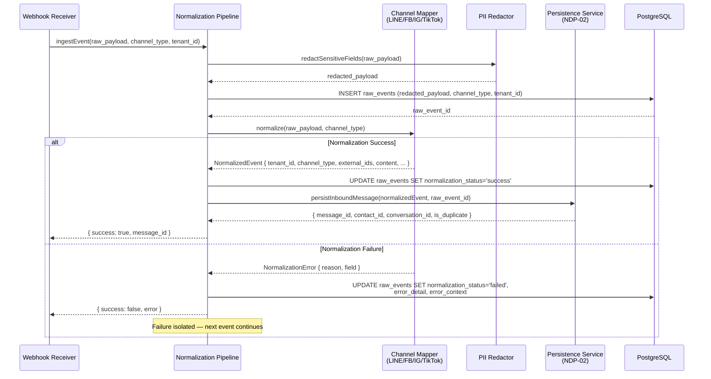
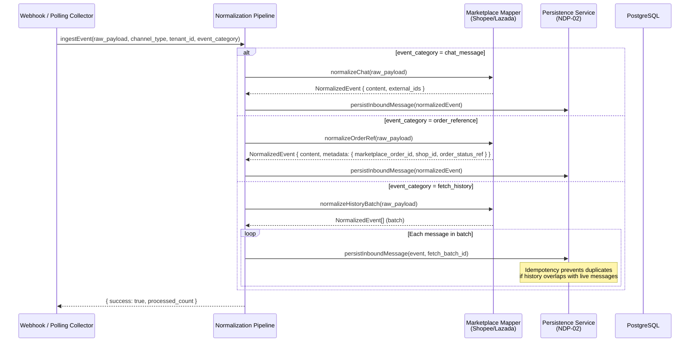
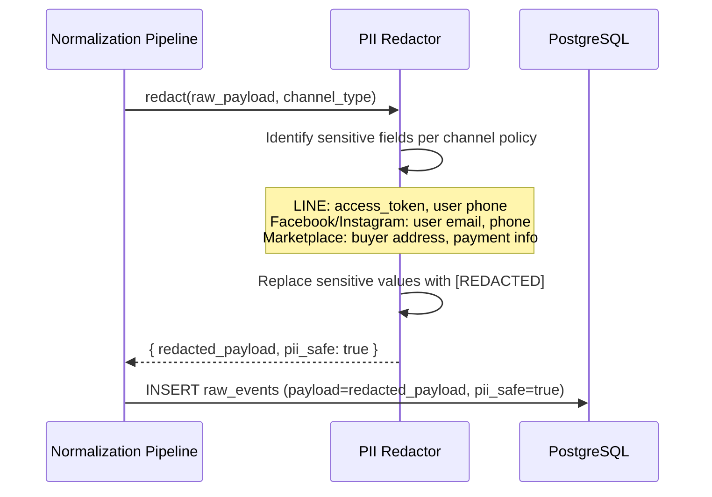
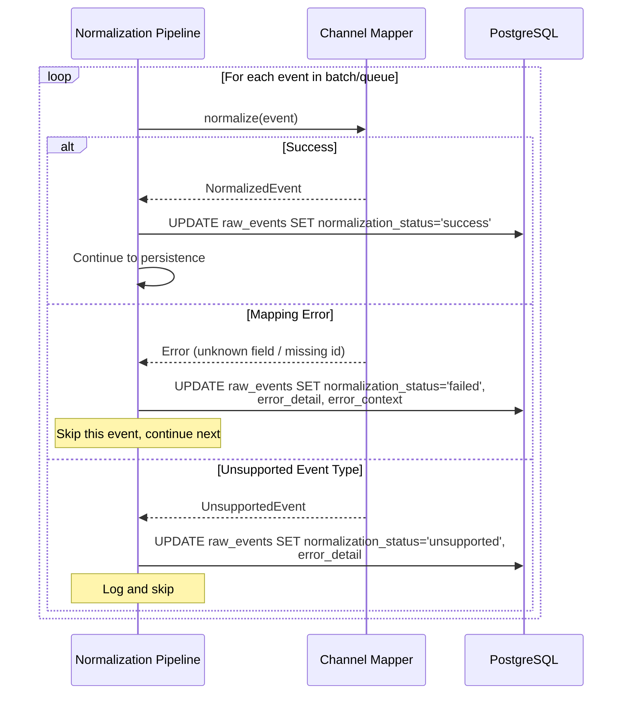

# ACE-39 (NDP-03): Normalization Pipeline v1 — Sequence Diagram

## Context

Sequence diagrams for the normalization layer: converting raw channel payloads into normalized schema v1 objects. Covers social channels, marketplace channels, PII redaction, and failure isolation.

---

## 1. Unified Normalization Flow (Social Channels)

---

## 2. Marketplace Normalization (Shopee/Lazada)

---

## 3. PII Redaction Flow

---

## 4. Failure Isolation

