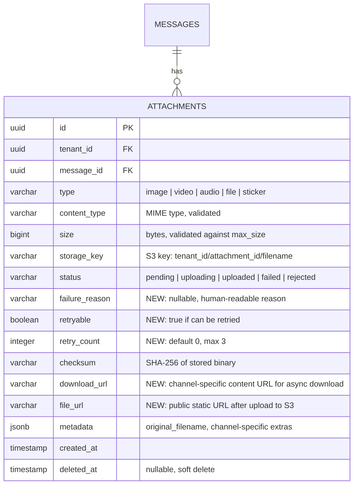

# ACE-40 (NDP-04): Attachment Storage v1 — ER Diagram

## Context

Extends ACE-37 attachments table with fields for async download, retry logic, failure tracking, and validation. Size/type limits are managed via application config (env vars or config file).

---

## ER Diagram



---

## New Fields on `attachments` (vs ACE-37)

| Field | Type | Purpose |
|---|---|---|
| `failure_reason` | varchar nullable | Why download/upload failed (e.g., `download_timeout`, `exceeds_size_limit`, `unsupported_content_type`) |
| `retryable` | boolean | Whether this failure can be retried |
| `retry_count` | integer | Current retry attempt count (max 3) |
| `download_url` | varchar nullable | Channel-specific URL to download binary (used by async worker) |
| `file_url` | varchar nullable | Public static URL after upload to S3 (e.g., `https://{bucket}.s3.amazonaws.com/{key}`) |

---

## Attachment Status Lifecycle

```
pending → uploading → uploaded     (happy path)
pending → uploading → failed       (download/upload error, retryable)
pending → rejected                 (validation: size/type exceeded)
failed  → uploading → uploaded     (manual retry success)
```

---

## Attachment Size/Type Validation (Application Config)

Size and type limits are managed via application config (not a DB table):

```yaml
# Example config
attachment_limits:
  image/*:  { max_size: 10485760, allowed: true }   # 10MB
  video/mp4: { max_size: 52428800, allowed: true }   # 50MB
  video/*:  { max_size: 52428800, allowed: true }    # 50MB
  audio/*:  { max_size: 26214400, allowed: true }    # 25MB
  application/pdf: { max_size: 10485760, allowed: true }
```

> Migrate to a DB table if runtime admin editing is needed in a future iteration.

---

## S3 Key Convention

```
Format:  {tenant_id}/{attachment_id}/{original_filename_or_hash}
Example: 550e8400-e29b/7c9e6679-f3b8/photo_2024.jpg
```
