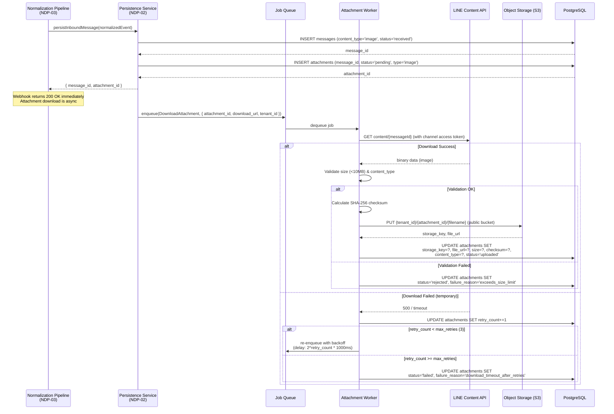
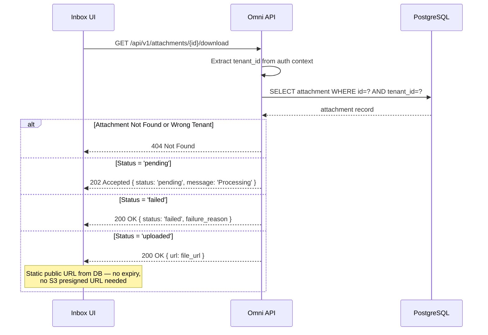
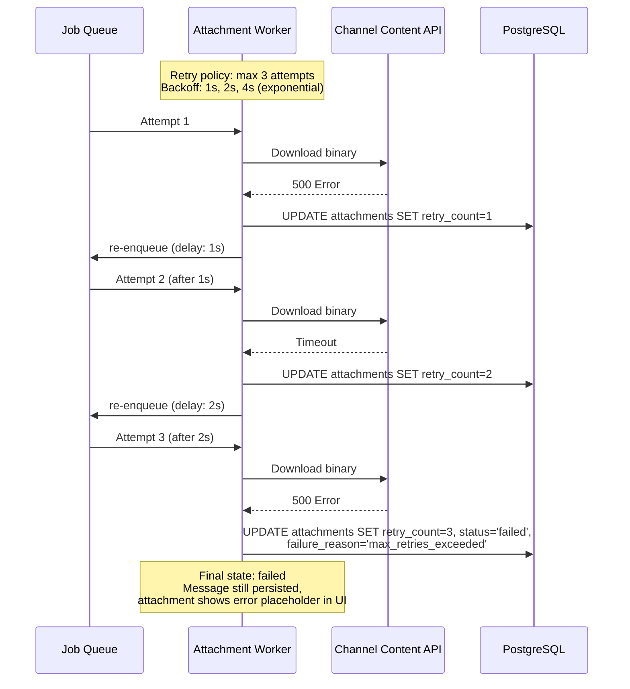

# ACE-40 (NDP-04): Attachment Storage v1 — Sequence Diagram

## Context

Sequence diagrams for the attachment pipeline: async download from channel APIs, upload to S3 (public bucket), retry with backoff, and retrieval via static URLs. R1 must-have is LINE images end-to-end.

---

## 1. Async Attachment Download & Store (LINE Image)

---

## 2. Static URL Retrieval

> **Note:** S3 bucket is public. `file_url` is stored in DB at upload time. No presigned download URL generation needed.

---

## 3. Retry with Backoff

