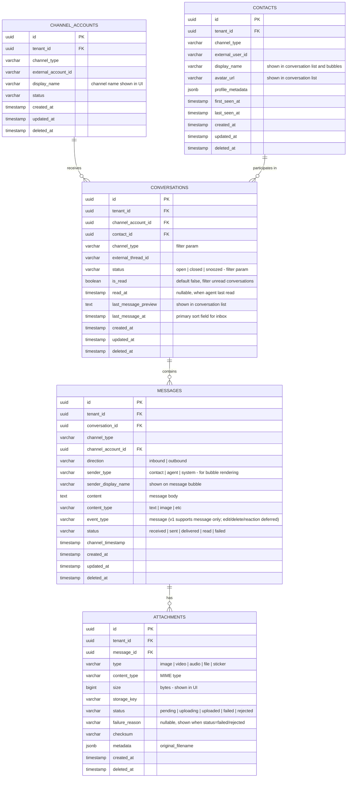

# ACE-41 (NDP-05): Conversation Timeline Query API v1 — ER Diagram

## Context

Uses ACE-37 + ACE-38 schema. This diagram highlights the fields and indexes critical for query performance and UI rendering.

---

## ER Diagram

---

## Key Indexes for Query Performance

| Table | Index | Used By | Purpose |
|---|---|---|---|
| `conversations` | `(tenant_id, status, last_message_at DESC)` | List conversations | Inbox sort + filter |
| `conversations` | `(tenant_id, channel_type, last_message_at DESC)` | Filter by channel | Channel filter |
| `conversations` | `(tenant_id, channel_account_id, last_message_at DESC)` | Filter by account | Account filter |
| `messages` | `(tenant_id, conversation_id, created_at DESC)` | Timeline pagination | Cursor-based pagination |
| `attachments` | `(message_id)` | Timeline join | Fetch attachments for messages |

---

## Performance Baseline Targets

| Query | Target p95 | Volume Assumption |
|---|---|---|
| List conversations (20 items) | < 100ms | 10K conversations per tenant |
| Message timeline (20 items) | < 80ms | 1K messages per conversation |
| Conversation detail | < 50ms | Single row + JOINs |
