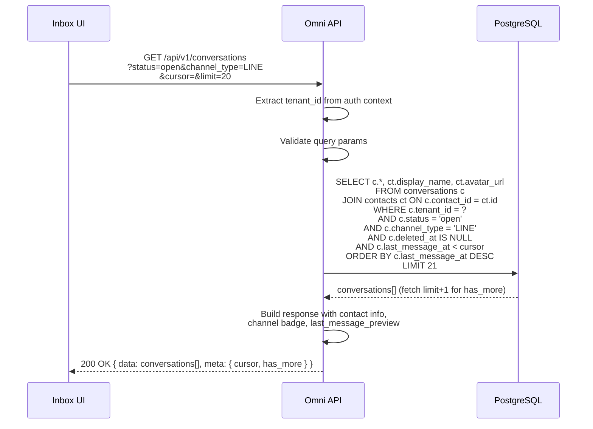
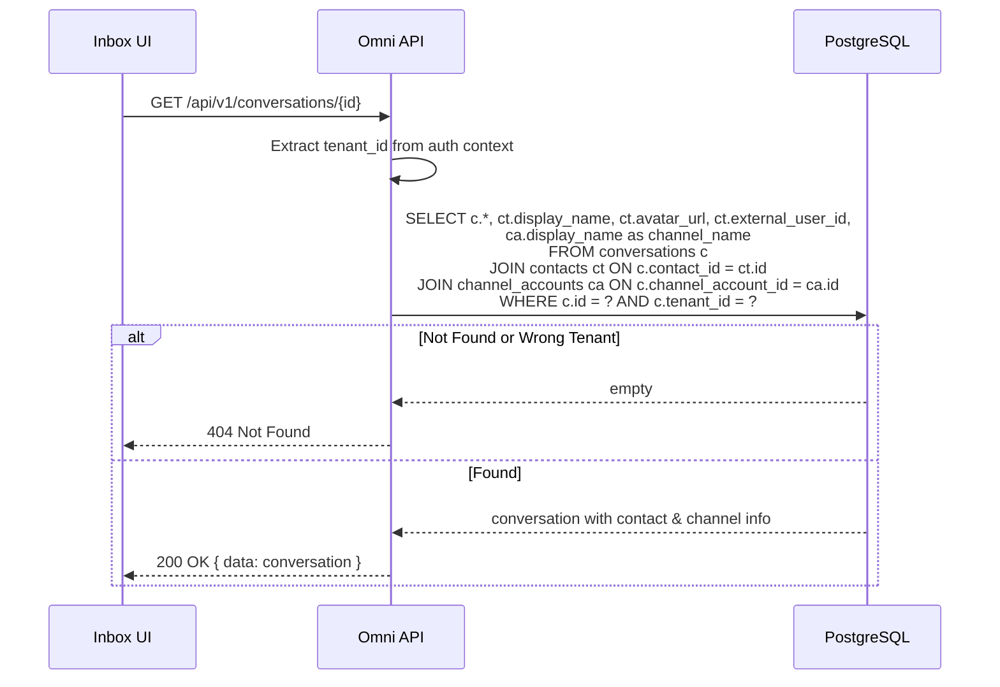
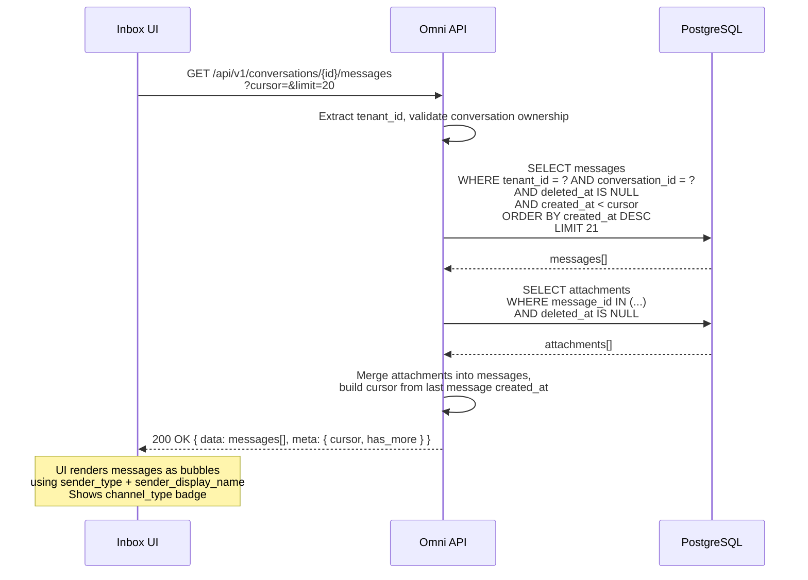
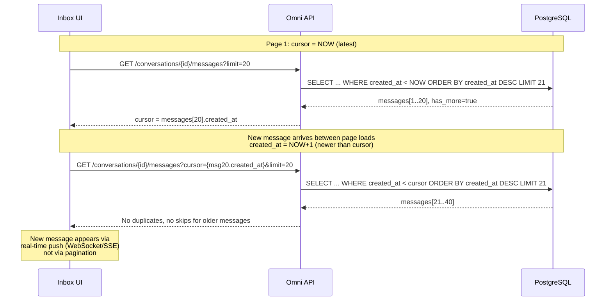

# ACE-41 (NDP-05): Conversation Timeline Query API v1 — Sequence Diagram

## Context

Sequence diagrams for the read-side API: listing conversations for inbox view, fetching message timelines with attachments, and ensuring pagination consistency under concurrent writes.

---

## 1. List Conversations (Inbox View)

---

## 2. Get Conversation Detail

---

## 3. Fetch Message Timeline with Attachments

---

## 4. Pagination Consistency Under Concurrent Writes

