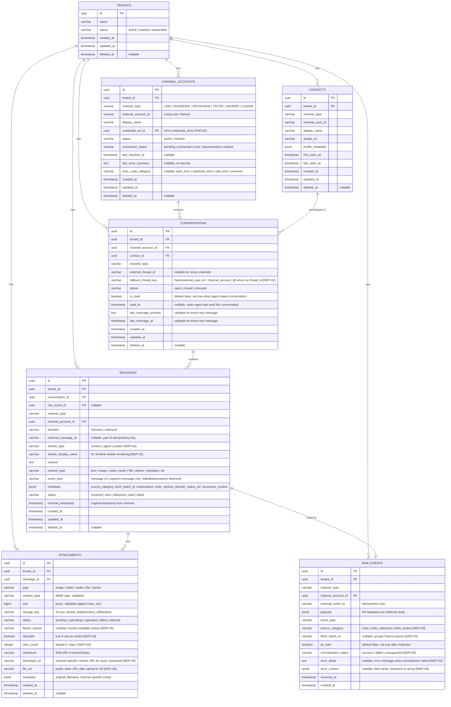

# EPIC ACE-31: Normalized Data Platform v1 — Consolidated ER Diagram

## Context

Consolidated Entity-Relationship diagram merging all schema definitions from NDP-01 through NDP-05. All channels (LINE, Facebook, Instagram, TikTok, Shopee, Lazada) are stored in one consistent model with multi-tenant isolation by design.

### Source Stories

| Story | Contribution |
|---|---|
| ACE-37 (NDP-01) | Base schema: Tenant, ChannelAccounts, Contacts, Conversations, Messages, Attachments, RawEvents |
| ACE-38 (NDP-02) | New fields: `fallback_thread_key`, `sender_type`, `sender_display_name`; marketplace structured content merged into `metadata` |
| ACE-39 (NDP-03) | New fields on raw_events: `source_category`, `fetch_batch_id`, `normalization_status`, `error_detail`, `error_context` |
| ACE-40 (NDP-04) | New fields on attachments: `failure_reason`, `retryable`, `retry_count`, `download_url`, `file_url` |
| ACE-41 (NDP-05) | No new schema — query indexes and performance targets only |

---

## ER Diagram



---

## Data Dictionary

### tenants — Organization using the platform

| Field | Type | Description |
|---|---|---|
| `id` | uuid PK | Primary key |
| `name` | varchar | Company/store name, e.g. "ABC Shop" |
| `status` | varchar | Tenant status (active / inactive / suspended) |
| `created_at` | timestamp | Record creation timestamp |
| `updated_at` | timestamp | Last modification timestamp |
| `deleted_at` | timestamp | Soft delete — null = active |

### channel_accounts — Connected channel accounts

| Field | Type | Description |
|---|---|---|
| `id` | uuid PK | Primary key |
| `tenant_id` | uuid FK | Reference to owning tenant |
| `channel_type` | varchar | Channel type: LINE, FACEBOOK, INSTAGRAM, TIKTOK, SHOPEE, LAZADA |
| `external_account_id` | varchar | Account ID from the channel platform, e.g. LINE OA ID, FB Page ID — unique per channel |
| `display_name` | varchar | Display name of the channel account, e.g. "My LINE OA" |
| `credential_ref_id` | uuid FK | Reference to credential store (FND-02) — tokens/secrets stored separately |
| `status` | varchar | Account status: active / inactive |
| `connection_status` | varchar | Connection health: pending, connected, error, disconnected, expired |
| `last_checked_at` | timestamp | Last time connection status was checked |
| `last_error_summary` | text | Latest error summary (no secrets) — null if no error |
| `error_code_category` | varchar | Error category: auth_error, webhook_error, rate_limit, unknown |
| `created_at` | timestamp | Record creation timestamp |
| `updated_at` | timestamp | Last modification timestamp |
| `deleted_at` | timestamp | Soft delete |

### contacts — Customers who have messaged

| Field | Type | Description |
|---|---|---|
| `id` | uuid PK | Primary key |
| `tenant_id` | uuid FK | Reference to tenant |
| `channel_type` | varchar | Channel the customer messaged from |
| `external_user_id` | varchar | Customer ID from the channel, e.g. LINE userId (U1234), FB PSID — combined with tenant_id + channel_type forms unique key |
| `display_name` | varchar | Customer display name — updated on every inbound message (UPSERT) |
| `avatar_url` | varchar | Profile picture URL — updated on every inbound message |
| `profile_metadata` | jsonb | Additional data from channel, e.g. language, tags from LINE |
| `first_seen_at` | timestamp | When the customer first messaged |
| `last_seen_at` | timestamp | When the customer last messaged — updated on every inbound |
| `created_at` | timestamp | Record creation timestamp |
| `updated_at` | timestamp | Last modification timestamp |
| `deleted_at` | timestamp | Soft delete |

### conversations — Chat rooms

| Field | Type | Description |
|---|---|---|
| `id` | uuid PK | Primary key |
| `tenant_id` | uuid FK | Reference to tenant |
| `channel_account_id` | uuid FK | Channel account that received the message, e.g. which LINE OA |
| `contact_id` | uuid FK | Customer participating in this conversation |
| `channel_type` | varchar | Channel type (denormalized from channel_accounts for faster queries) |
| `external_thread_id` | varchar | Thread/conversation ID from the channel, e.g. FB conversation ID — nullable for channels without thread concept (e.g. LINE) |
| `fallback_thread_key` | varchar | Used instead of external_thread_id when channel has no thread — computed as hash(external_user_id + channel_account_id) [NDP-02] |
| `status` | varchar | Conversation status: open (active), closed, snoozed |
| `is_read` | boolean | Whether agent has read — default false, set true when agent opens conversation |
| `read_at` | timestamp | When the agent last read this conversation |
| `last_message_preview` | text | Latest message text for Inbox list display — updated on every new message |
| `last_message_at` | timestamp | Timestamp of the latest message — used as Inbox sort key |
| `created_at` | timestamp | Record creation timestamp |
| `updated_at` | timestamp | Last modification timestamp |
| `deleted_at` | timestamp | Soft delete |

### messages — Individual messages

| Field | Type | Description |
|---|---|---|
| `id` | uuid PK | Primary key |
| `tenant_id` | uuid FK | Reference to tenant |
| `conversation_id` | uuid FK | Conversation this message belongs to |
| `raw_event_id` | uuid FK | Reference back to the raw event (nullable — outbound messages have no raw event) |
| `channel_type` | varchar | Channel type (denormalized) |
| `channel_account_id` | uuid FK | Associated channel account |
| `direction` | varchar | Direction: inbound (customer → system) / outbound (agent → customer) |
| `external_message_id` | varchar | Message ID from the channel — used as idempotency key to prevent duplicates |
| `sender_type` | varchar | Who sent it: contact (customer), agent, system [NDP-02] |
| `sender_display_name` | varchar | Sender name for timeline bubble rendering [NDP-02] |
| `content` | text | Message body, e.g. "I'm interested in your product" |
| `content_type` | varchar | Content type: text, image, video, audio, file, sticker, template, etc. |
| `event_type` | varchar | Event type — v1 supports `message` only (edit/delete/reaction deferred) |
| `metadata` | jsonb | Additional data: source_category, fetch_batch_id, marketplace order_id/shop_id, structured_content |
| `status` | varchar | Message status: received, sent, delivered, read, failed |
| `channel_timestamp` | timestamp | Original timestamp from the channel (may differ slightly from created_at due to latency) |
| `created_at` | timestamp | When stored in our DB |
| `updated_at` | timestamp | Last modification timestamp |
| `deleted_at` | timestamp | Soft delete |

### attachments — File attachments

| Field | Type | Description |
|---|---|---|
| `id` | uuid PK | Primary key |
| `tenant_id` | uuid FK | Reference to tenant |
| `message_id` | uuid FK | Message this attachment belongs to |
| `type` | varchar | Attachment type: image, video, audio, file, sticker |
| `content_type` | varchar | MIME type, e.g. image/jpeg, video/mp4 — validated before upload |
| `size` | bigint | File size in bytes — validated against max_size before upload |
| `storage_key` | varchar | S3 key — format: `{tenant_id}/{attachment_id}/{filename}` |
| `status` | varchar | File status: pending → uploading → uploaded (success) / failed (error) / rejected (validation fail) |
| `failure_reason` | varchar | Human-readable failure reason, e.g. "download_timeout", "file_too_large" [NDP-04] |
| `retryable` | boolean | Whether retry is possible — true for timeout/network errors, false for validation failures [NDP-04] |
| `retry_count` | integer | Number of retries attempted — default 0, max 3 [NDP-04] |
| `checksum` | varchar | SHA-256 hash of the stored binary — used for integrity verification |
| `download_url` | varchar | Channel-specific content URL for async download — used once during download [NDP-04] |
| `file_url` | varchar | Static public URL after upload to S3 — permanent, no expiry [NDP-04] |
| `metadata` | jsonb | Additional data, e.g. original_filename, channel-specific extras |
| `created_at` | timestamp | Record creation timestamp |
| `deleted_at` | timestamp | Soft delete |

### raw_events — Raw webhook payloads (system table)

| Field | Type | Description |
|---|---|---|
| `id` | uuid PK | Primary key |
| `tenant_id` | uuid FK | Reference to tenant |
| `channel_type` | varchar | Channel the webhook came from |
| `channel_account_id` | uuid FK | Channel account that received the webhook |
| `external_event_id` | varchar | Event ID from the channel — used as idempotency key to prevent duplicate webhooks |
| `payload` | jsonb | PII-redacted raw webhook body (userId, avatar masked; message content preserved) |
| `event_type` | varchar | Event type, e.g. message, follow, unfollow |
| `source_category` | varchar | Data category: chat (normal message), order_reference (purchase), fetch_history (historical pull) [NDP-03] |
| `fetch_batch_id` | varchar | Batch ID for history imports — groups messages pulled together in a single batch [NDP-03] |
| `pii_safe` | boolean | Whether PII redaction has been applied — default false, set true after redaction |
| `normalization_status` | varchar | Normalization result: success, failed, unsupported [NDP-03] |
| `error_detail` | text | Error message when normalization failed, e.g. "Missing external_user_id" [NDP-03] |
| `error_context` | jsonb | Error context: which field, expected vs actual value [NDP-03] |
| `received_at` | timestamp | When Gateway received the webhook |
| `created_at` | timestamp | When stored in DB |

> **Note:** raw_events has **no** `deleted_at` or `updated_at` — kept permanently for audit. Content is never modified (only `normalization_status` can be updated).

---

## Consolidated Indexes

| Table | Index | Source | Purpose |
|---|---|---|---|
| `messages` | `(tenant_id, created_at)` | NDP-01 | Global timeline query |
| `messages` | `(tenant_id, conversation_id, created_at DESC)` | NDP-01, NDP-05 | Conversation thread pagination (cursor-based) |
| `conversations` | `(tenant_id, channel_type, external_thread_id)` | NDP-01 | Upsert lookup on inbound event |
| `conversations` | `(tenant_id, status, last_message_at DESC)` | NDP-01, NDP-05 | Inbox list sorted by recent + status filter |
| `conversations` | `(tenant_id, channel_type, last_message_at DESC)` | NDP-05 | Channel type filter |
| `conversations` | `(tenant_id, channel_account_id, last_message_at DESC)` | NDP-05 | Channel account filter |
| `contacts` | `(tenant_id, channel_type, external_user_id)` | NDP-01 | Upsert contact on inbound event |
| `channel_accounts` | `(tenant_id, channel_type, external_account_id)` | NDP-01 | Lookup channel account |
| `raw_events` | `(tenant_id, channel_type, external_event_id)` | NDP-01 | Idempotency check |
| `raw_events` | `(tenant_id, fetch_batch_id)` WHERE fetch_batch_id IS NOT NULL | NDP-03 | Query history import batches |
| `attachments` | `(message_id)` | NDP-01, NDP-05 | Join attachments to message |
| `raw_events` | `(tenant_id, normalization_status, created_at)` WHERE normalization_status != 'success' | NDP-03 | Query failed normalizations for review |

---

## Consolidated Unique Constraints

| Table | Constraint | Source |
|---|---|---|
| `contacts` | `UNIQUE (tenant_id, channel_type, external_user_id)` | NDP-01 |
| `channel_accounts` | `UNIQUE (tenant_id, channel_type, external_account_id)` | NDP-01 |
| `conversations` | `UNIQUE (tenant_id, channel_account_id, external_thread_id)` WHERE external_thread_id IS NOT NULL | NDP-01 |
| `conversations` | `UNIQUE (tenant_id, channel_account_id, fallback_thread_key)` WHERE fallback_thread_key IS NOT NULL | NDP-02 |
| `messages` | `UNIQUE (tenant_id, channel_type, external_message_id)` WHERE external_message_id IS NOT NULL | NDP-01, NDP-02 |
| `raw_events` | `UNIQUE (tenant_id, channel_type, external_event_id)` | NDP-01 |

---

## Attachment Status Lifecycle (NDP-04)

```
pending → uploading → uploaded     (happy path)
pending → uploading → failed       (download/upload error, retryable)
pending → rejected                 (validation: size/type exceeded)
failed  → uploading → uploaded     (manual retry success)
```

---

## S3 Key Convention (NDP-04)

```
Format:  {tenant_id}/{attachment_id}/{original_filename_or_hash}
Example: 550e8400-e29b/7c9e6679-f3b8/photo_2024.jpg
```

> **Note:** S3 bucket is **public**. After upload, `file_url` is a permanent static URL (e.g., `https://{bucket}.s3.amazonaws.com/{key}`). No presigned download URL needed — auth is handled at the application level, and UUID-based paths prevent guessing.

---

## Performance Baseline Targets (NDP-05)

| Query | Target p95 | Volume Assumption |
|---|---|---|
| List conversations (20 items) | < 100ms | 10K conversations per tenant |
| Message timeline (20 items) | < 80ms | 1K messages per conversation |
| Conversation detail | < 50ms | Single row + JOINs |

---

## Entity Summary

| Entity | Table | Count | Source Story |
|---|---|---|---|
| Core | `tenants` | 1 | NDP-01 |
| Core | `channel_accounts` | 2 | NDP-01 |
| Core | `contacts` | 3 | NDP-01 |
| Core | `conversations` | 4 | NDP-01, NDP-02 |
| Core | `messages` | 5 | NDP-01, NDP-02 |
| Core | `attachments` | 6 | NDP-01, NDP-04 |
| Core | `raw_events` | 7 | NDP-01, NDP-03 |
| **Total** | | **7 tables** | |

> **Note:** Attachment size/type validation uses application config (env vars or config file) instead of a database table. This keeps v1 simple — migrate to a DB table if runtime admin editing is needed later.
