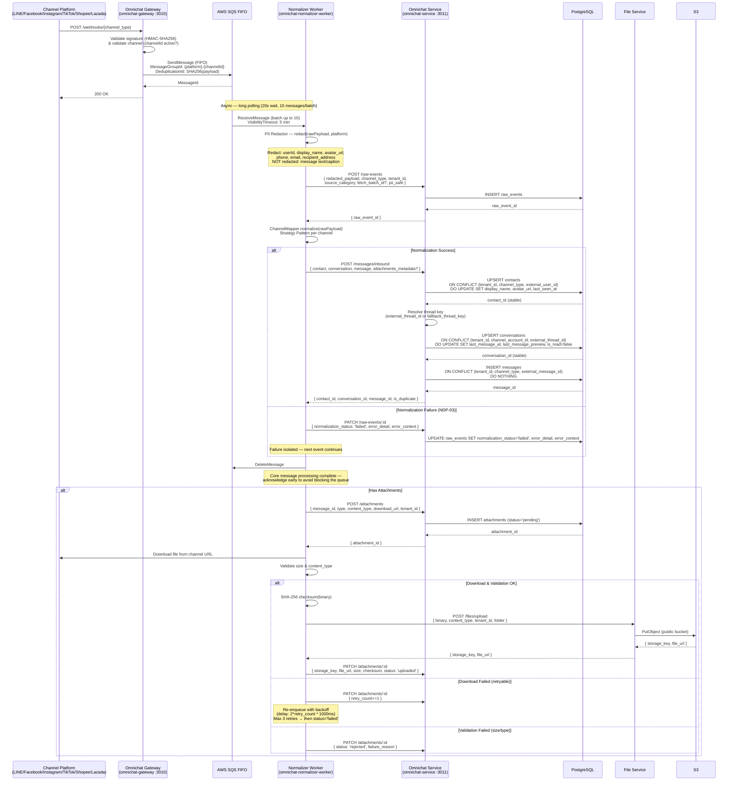
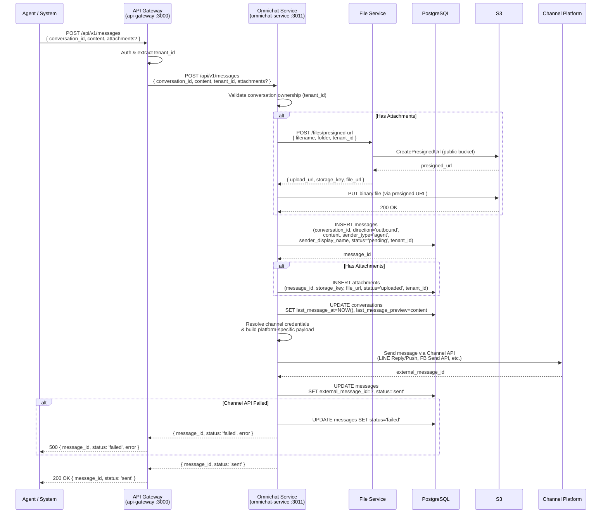
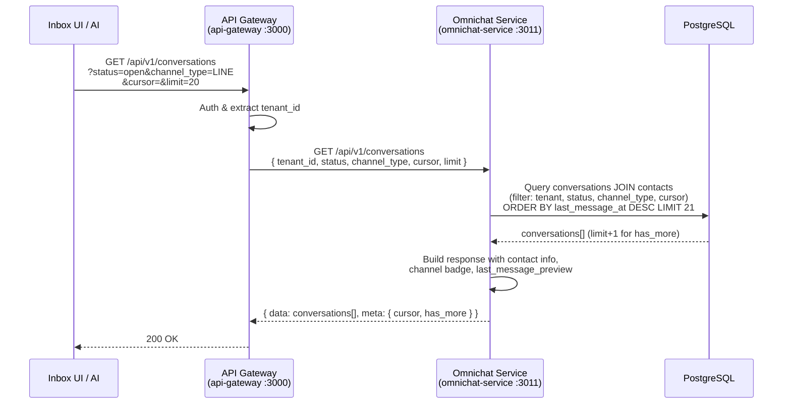
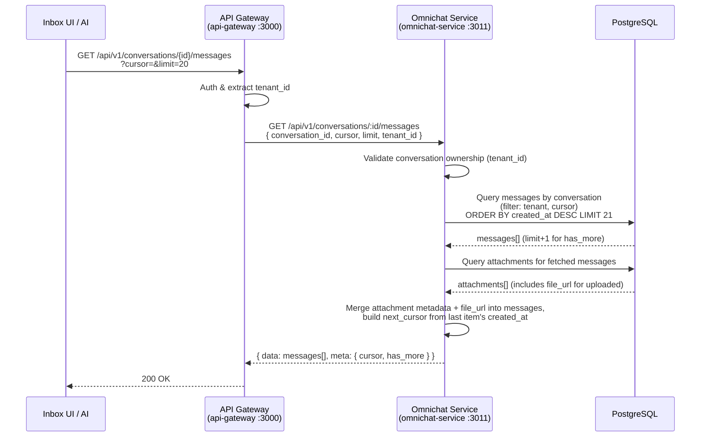
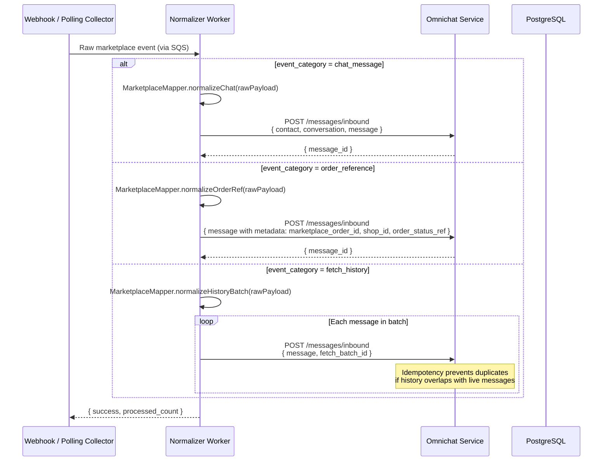

# EPIC ACE-31: Normalized Data Platform v1 — Consolidated Sequence Diagram

## Context

Consolidated sequence diagrams covering the full Normalized Data Platform — from webhook ingestion through normalization, persistence, attachment handling, and query APIs. Architecture follows the microservice layout defined in NDP-01.

### Source Stories

| Story | Flow Coverage |
|---|---|
| ACE-37 (NDP-01) | Microservice architecture, inbound/outbound/query flows (physical layout) |
| ACE-38 (NDP-02) | Persistence patterns: idempotent inserts, deterministic upserts, fallback thread key |
| ACE-39 (NDP-03) | Normalization: channel mappers, PII redaction, marketplace events, failure isolation |
| ACE-40 (NDP-04) | Attachment pipeline: async download, retry with backoff, signed URL retrieval |
| ACE-41 (NDP-05) | Query APIs: conversation list, timeline pagination, concurrent write consistency |

---

## Service Overview

| Service | App Name | Responsibility | Transport |
|---|---|---|---|
| **Omnichat Gateway** | `omnichat-gateway` | Inbound only — receive webhooks, validate signature, publish to SQS | HTTP REST (:3010) |
| **Normalizer Worker** | `omnichat-normalizer-worker` | Poll SQS, PII redaction, normalize, download attachments — persist via Omnichat Service (HTTP) | SQS Consumer |
| **Omnichat Service** | `omnichat-service` | Core business logic — DB owner, outbound messages, conversation management | HTTP (:3011) |
| **File Service** | `file-service` | Manage S3 (presigned upload URL, binary upload — public bucket, static URLs) | HTTP (inter-service) |
| **API Gateway** | `api-gateway` | Entry point, routing, auth | HTTP REST (:3000) |

### Rate Limiting (Omnichat Gateway)

| Window | Limit |
|---|---|
| Short (per second) | 5 requests |
| Long (per minute) | 100 requests |

### SQS FIFO Configuration

| Setting | Value | Rationale |
|---|---|---|
| Queue Type | FIFO (.fifo) | Exactly-once processing, message ordering per group |
| MessageGroupId | `{platform}-{channelId}` | Messages from the same channel are processed in order |
| DeduplicationId | SHA256(payload content) | Prevent duplicate webhook delivery |
| VisibilityTimeout | 5 minutes | Allow worker time to process before message returns to queue |
| WaitTimeSeconds | 20 seconds | Long polling — reduce empty receives |
| MaxMessages | 10 per batch | Worker receives a batch and processes with Promise.allSettled() |

---

## 1. Inbound Message Flow (Full End-to-End)

Combines: NDP-01 architecture + NDP-03 normalization + NDP-02 persistence + NDP-04 attachment handling



---

## 2. Outbound Message Flow

Combines: NDP-01 architecture + NDP-02 persistence



---

## 3. Query Conversation List (Inbox View)

Source: NDP-05



> **Pagination consistency:** Cursor-based pagination on `last_message_at` ensures no duplicates or skips under concurrent writes. New messages (with newer timestamps) do not affect pages already fetched.

---

## 4. Query Conversation Timeline (Messages + Attachments)

Combines: NDP-01 architecture + NDP-02 persistence + NDP-05 query API

> **Note:** Timeline returns attachment metadata **including `file_url`** (static public URL, no expiry) for uploaded attachments. A separate endpoint `GET /api/v1/attachments/:id/download` is available for attachment status checks (pending/failed), but not shown here as the primary access path is via timeline.



> **Pagination consistency:** Cursor-based pagination on `created_at` ensures no duplicates or skips under concurrent writes. New messages appear via real-time push (WebSocket/SSE), not via pagination.

---

## 5. Marketplace Normalization (Shopee/Lazada)

Source: NDP-03




---

## Service Communication Map

```
┌──────────────┐
│   Channel    │
│  Platforms   │
└──────┬───────┘
       │ Webhook (HTTP)              ▲
       ▼                             │ Channel API (HTTP)
┌──────────────────┐    SQS FIFO    ┌──────────────────────┐
│ Omnichat Gateway │───────────────▶│  Normalizer Worker    │
│ (omnichat-gateway│                │  (omnichat-normalizer │
│  :3010)          │                │   -worker)            │
│                  │                │                       │
│ Inbound only:    │                │  - PII Redactor       │
│  - Signature     │                │  - Channel Mapper     │
│    Validation    │                │    (Strategy Pattern)  │
│  - Rate Limiting │                │  - Attachment download │
│    (5/s, 100/m)  │                │    (fire-and-forget)  │
│  - SQS publish   │                │  - Persist via        │
└──────────────────┘                │    OmniSvc (HTTP)     │
                                    └──────┬──────┬─────────┘
                                           │      │
                                      HTTP ┘      │ HTTP
                                     (persist)    │ (upload)
                                           │      │
                                           ▼      ▼
                              ┌──────────────┐  ┌──────────────┐
                              │ Omnichat     │  │ File Service │──▶ S3
                              │ Service      │  │ (file-service│
                              │ (omnichat-   │  │  :HTTP)      │
                              │  service     │  └──────────────┘
                              │  :3011)      │        ▲
                              │              │        │ HTTP
                              │  - DB owner  │────────┘
                              │  - Outbound  │
                              │    send      │──▶ Channel Platforms
                              │  - Business  │    (HTTP — outbound)
                              │    logic     │
                              └──────┬───────┘
                                     │
                                     │ DB
                                     ▼
                              ┌──────────┐
                              │PostgreSQL│
                              └──────────┘
                                     ▲
                                     │ HTTP
┌──────────────┐             ┌──────────────┐
│   Agent /    │             │ API Gateway  │
│   Inbox UI   │────HTTP────▶│ (api-gateway │
└──────────────┘             │  :3000)      │
                             └──────────────┘
```

---

## Flow Summary

| # | Flow | Direction | Sync/Async | Source Stories | Key Points |
|---|---|---|---|---|---|
| 1 | Inbound Message | Channel → System | Async (SQS) | NDP-01,02,03,04 | Fast webhook response, PII redaction, idempotent persist, async attachments |
| 2 | Outbound Message | System → Channel | Sync send | NDP-01,02 | Upload S3 first, persist, then send to channel |
| 3 | Conversation List | Client ← System | Sync read | NDP-05 | Cursor pagination on last_message_at, no duplicates under concurrent writes |
| 4 | Message Timeline | Client ← System | Sync read | NDP-02,04,05 | Cursor pagination on created_at, attachment metadata + file_url (static public URL) |
| 5 | Marketplace Normalization | Webhook/Poll → System | Async | NDP-03 | Chat, order reference, fetch history batch |
